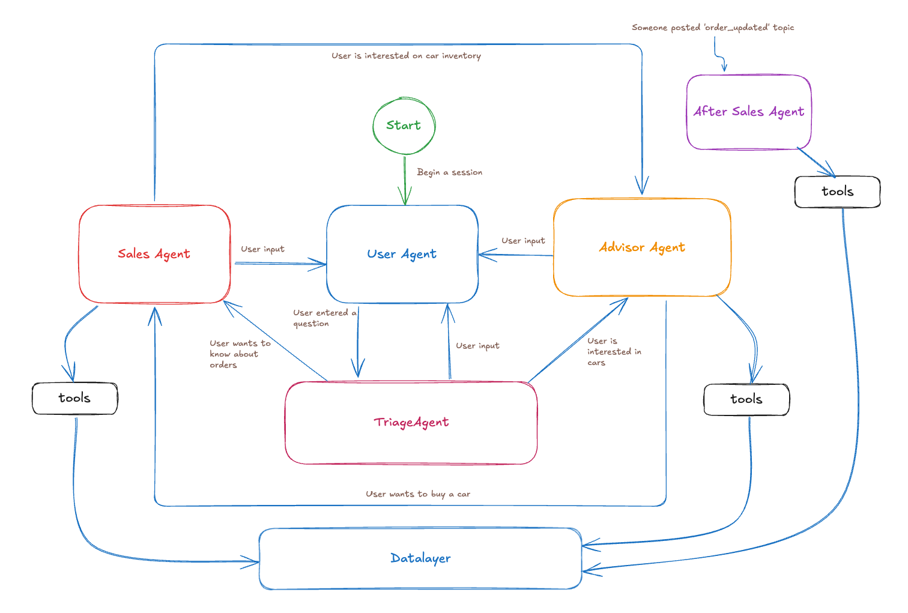

## CarDream AutoGen demo  

CarDream is an online car retailer that want to make the experience of buying a car be enjoyable as possible.  
The system, based on your inputs will guide you through the available models and will let you pick the one that fits you.
You can then buy it, or, in case you have already made some order, see them and cancel them.

### How to run it
Navigate to `demo` folder and use `uv run main.py` to run the demo.

### How to use it
Due to 'educational' role of this project all the interaction is done via console where you will also see several logs
whose goal is to give you an idea of what is going on under the hood.  
The agent is not rock solid, but browsing through code maybe you can have some ideas of how to structure you next AutoGen
project.

Here's is a workflow example, but feel free to play with it.  

- Once welcomed type *"I wish to buy a car"*
- You can now see that the triage_agent recognized you want to be advised so now is the advisor_agent chatting with you.
- Now try typing: *I like Audi, what models do you have?*
- The agent now should prompt you about some other details, try entering: *"I want to spend max 40K"*
- Note how the agent used the `get_available_cars` to find what models could be suitable for you.
- Now select one car, you could try entering: *I want to buy the one from 2022*
- If you noticed, you are now redirected to the `sales_agent` to continue the ordering process.
- Follow the indication that should probably be to provide your email and name. Enter any value you like.
- If everything is ok, you should now be asked to confirm, do it 🙂
- Now that the car is ordered, the agent will notify you about the order status.
- You can check your order by asking: *May i see my orders*
- You should see your recent order.
- Exit the session by typing *exit*

now run the project again with `uv run main.py`

- enter: *I want to see my orders*
- As requested, provide the name you used for your order...
- Now type: *sorry, i don't want this car anymore*.
- Your order should be deleted and later see a notification message.
- If you want you can try ordering another car just entering something like: *May I see other cars?*
- Otherwise type *exit* to leave,

This is just an example, feel free to explore different paths.

### How to reset the database
The projects creates a SQLlite database at startup and imports all the cars included in the `data/cars.csv`.  
If you want, after some tests, start from scratch, just delete the `data/cars.db` and it will be recreated at the next run.

### Architecture

The solution is made up of 5 agents  

- **User Agent**: Is the agent in charge of welcoming the user and handling all the requests typed by the user.
- **Triage Agent**: Handles the request coming from the User Agent and the other agents and, depending on the contents forwards them to the proper agent or back to the user agent if not pertinent.
- **Advisor Agent**: Support the user in finding the car, when user identify one he wants to buy it handsoff to the Sales Agent
- **Sales Agent**: Manages the orders, it can list user orders, delete an order and handle the order of a new car.
- **After Sales Agent** It listed to a single topic `order_updated` when an agent posts it, it takes the involved order and creates a message to inform the user about an order update,
